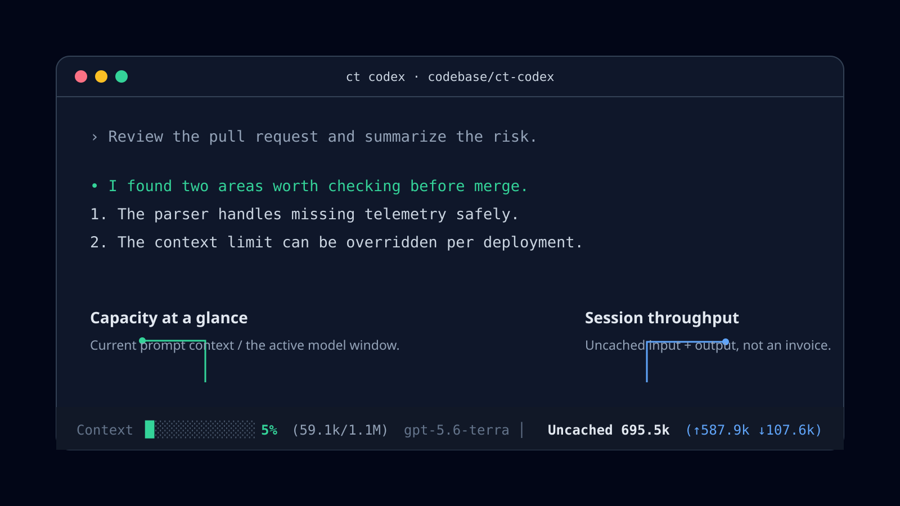
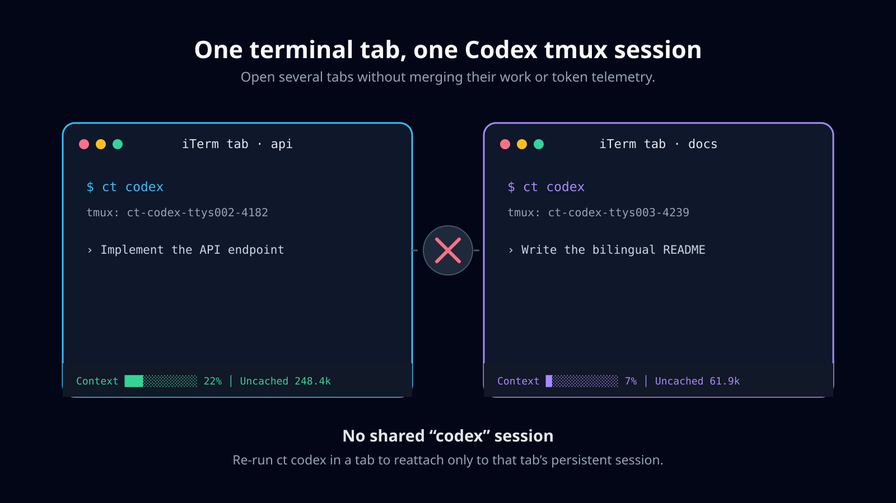

# ct-codex

[](https://github.com/Michael5531/ct-codex/actions/workflows/verify.yml)
[](LICENSE)
[](#supported-platforms)
[](CHANGELOG.md)

[中文文档](README.zh-CN.md) · [Platform setup](docs/platform-setup.md) · [Contributing](CONTRIBUTING.md) · [Changelog](CHANGELOG.md)

`ct-codex` installs `ct`, a portable tmux launcher for the Codex CLI. It gives each terminal tab its own persistent tmux session and renders a compact token-usage bar at the bottom of that session.

> **Pre-release** — install directly from GitHub with `npx -y github:Michael5531/ct-codex install`. The shorter npm command will be available after the first npm release.

## The problem it solves

During long Codex TUI sessions, there is no persistent, continuously updated view of the current session's token usage or context window. `/usage` is not Azure Foundry hosted usage and is not an Azure billing meter, so it cannot provide that view for Azure-hosted deployments.

`ct` keeps local, current-session telemetry visible at the bottom of the terminal while you work. Its **Uncached** figure is uncached input plus output tokens for operational tracking only; it is not an Azure Foundry invoice or an account-level cost calculation.

## Supported platforms

- macOS — iTerm2, Terminal, and other terminal emulators
- Linux
- WSL (run inside a Linux distribution)

Native Windows is not supported because `ct` relies on tmux and POSIX utilities.

## Install

Requirements: Node.js 18+, the Codex CLI, tmux, jq, lsof, ps, awk, sed, sort, and tail. See [platform setup](docs/platform-setup.md) for exact package-manager commands.

```sh
npx -y github:Michael5531/ct-codex install
ct doctor
ct codex
```

After the first npm release, the install command will become:

```sh
npx -y ct-codex install
```

The installer writes `ct` to `~/.local/bin/ct`. If that directory is not on your `PATH`, add this to your shell configuration and restart the shell:

```sh
export PATH="$HOME/.local/bin:$PATH"
```

Install to another directory when needed:

```sh
npx -y ct-codex install --bin-dir "$HOME/bin"
```

## Why `ct`?

- **Tab isolation** — each outer terminal tab gets its own stable tmux session instead of all tabs attaching to one shared `codex` session.
- **Per-pane usage** — the bottom bar reads only the active pane's Codex rollout log.
- **Portable setup** — one `npx` installer works on macOS, Linux, and WSL.

## See it in action

### Keep the Codex Context signal and throughput visible



The progress bar reimplements Codex CLI's own Context calculation from the active rollout record. It does not scrape the terminal or depend on `/statusline`. **Uncached** tracks session token throughput separately, so it cannot be mistaken for context capacity or an invoice.

### Keep terminal tabs independent



Each outer terminal tab receives its own tmux session. Reattaching with `ct codex` returns only to the session that belongs to that tab.

## How it behaves

- Run `ct codex` from any terminal tab.
- The outer terminal TTY and shell identity determine a stable tmux session name.
- Running `ct codex` again from the same tab reattaches to its own session.
- Other tabs get different sessions, so switching tabs never merges their Codex work.
- Running `ct codex` inside tmux starts Codex in the current tmux session rather than nesting tmux.
- Set `CT_SESSION_NAME=my-session` when a script needs an explicit name.

## Status bar

The bottom tmux bar tracks only the active pane's Codex rollout file:

```text
Context ██████░░░░░░ 50% used gpt-5.6-terra │ Uncached 1.1M (↑967.2k ↓144.1k) │ Cache 14.7M
```

- **Context** uses the active rollout's `last_token_usage.total_tokens` and `model_context_window`, with the same 12,000-token reserve and rounding order as Codex CLI. The 12-cell bar makes the result easy to scan at a glance.
- **Uncached** is uncached input plus output tokens accumulated during this session. It is token throughput, not a billing amount.
- **Cache** is cached input tokens, shown separately and excluded from **Uncached**.

The tmux window index list is deliberately hidden to keep the bar focused on usage.

### Context accuracy

`ct` is a source-level reimplementation of Codex CLI 0.148.0's Context calculation: it subtracts Codex's fixed 12,000-token baseline from the rollout window and last request total, rounds the remaining percentage, then displays `100 - remaining`. It prioritizes rollout-provided `model_context_window` and falls back to the normal top-level `model_context_window` in `~/.codex/config.toml`, matching Codex TUI's source precedence without a model-name table or hard-coded Terra value.

`/statusline` is optional and is not read by `ct`. If you enable `context-remaining` and `context-used` there, it is a useful independent double-check: the two values should match for the same current rollout. `ct` shows Context as unavailable only when the rollout has no usable context window.

## Commands

```sh
ct codex [codex arguments...]
ct doctor

npx -y github:Michael5531/ct-codex doctor
npx -y github:Michael5531/ct-codex uninstall
```

`uninstall` only removes a `ct` file installed by this package. It refuses to remove an unrelated command.

## Troubleshooting

- Run `ct doctor` first. It lists any missing local commands.
- If `ct: command not found`, add `~/.local/bin` to `PATH` and open a new shell.
- If the bar says `waiting for Codex in this pane`, start Codex with `ct codex` in that pane and wait for its first usage event.

## Development

```sh
npm test
npm run check
npm run pack:check
```

The GitHub Actions workflow validates the installer on macOS and Linux.

Before creating a release, use `npm version <patch|minor|major>` and then run `npm publish`. The unscoped npm package name must be available to your npm account; use a scoped name if it is not.

## License

[MIT](LICENSE)
